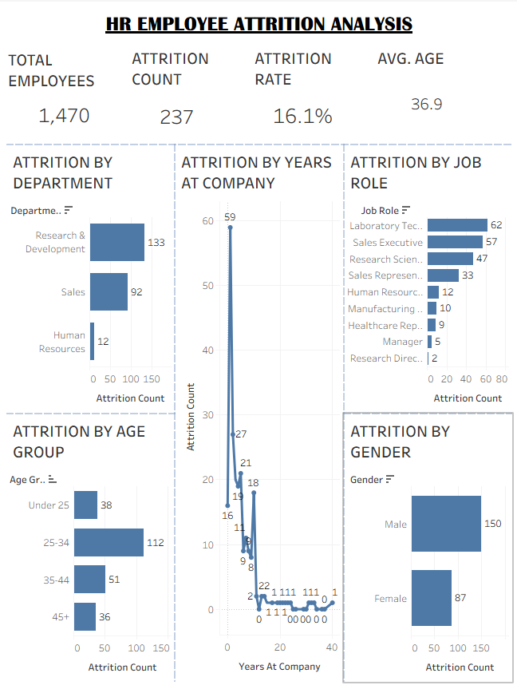
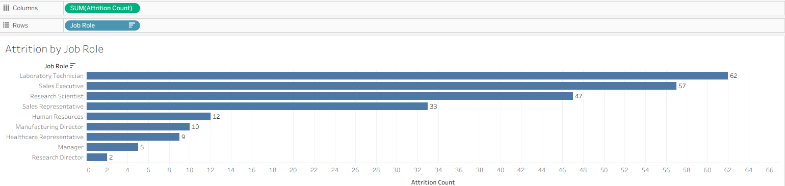

# HR Analytics Dashboard – Tableau

## Project Overview

This project is an HR Analytics Dashboard developed using Tableau to analyze employee attrition, workforce demographics, job roles, and employee retention patterns.

The dashboard transforms employee data into interactive visual insights that can help identify departments, job roles, age groups, and other employee characteristics associated with attrition.

## Objectives

* Analyze overall employee attrition.
* Identify departments with higher employee attrition.
* Analyze attrition across different job roles.
* Understand attrition patterns across age groups and gender.
* Analyze the relationship between employee tenure and attrition.
* Present HR insights through an interactive Tableau dashboard.

## Dashboard KPIs

* **Total Employees:** 1,470
* **Attrition Count:** 237
* **Attrition Rate:** 16.1%
* **Average Age:** 36.9 years

## Key Visualizations

The dashboard includes:

* Attrition by Department
* Attrition by Job Role
* Attrition by Age Group
* Attrition by Gender
* Attrition by Years at Company
* Key HR performance and attrition KPIs

## Tableau Concepts Used

* Tableau dashboards
* Calculated fields
* Aggregations
* Filters
* Bar charts
* Line charts
* Data storytelling
* Dashboard layout and formatting
* Demographic segmentation

## Calculated Fields

### Attrition Count

```text
IF [Attrition] = "Yes" THEN 1 ELSE 0 END
```

### Attrition Rate

```text
SUM(
    IF [Attrition] = "Yes" THEN 1 ELSE 0 END
)
/
COUNTD([Employee Number])
```

### Age Group

```text
IF [Age] < 25 THEN "Under 25"
ELSEIF [Age] < 35 THEN "25-34"
ELSEIF [Age] < 45 THEN "35-44"
ELSE "45+"
END
```

## Dataset

The project uses the IBM HR Analytics Employee Attrition & Performance dataset containing employee-level HR information.

## Tools Used

* Tableau Public
* Microsoft Excel / CSV
* GitHub

## Project Outcome

The dashboard provides a visual overview of employee attrition and highlights how attrition varies across departments, job roles, demographic groups, and employee tenure.

## Author

**Piyush Negi**

BCA Graduate | Data Analytics Enthusiast
## Dashboard Screenshots

### 1. HR Analytics Dashboard



### 2. Attrition by Job Role




#Tableau #HRAnalytics #DataAnalytics #DataVisualization #BusinessIntelligence #Dashboard #GitHub

